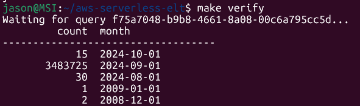
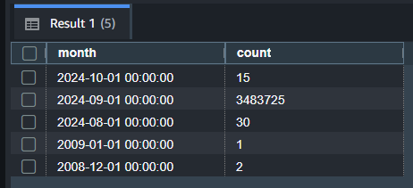
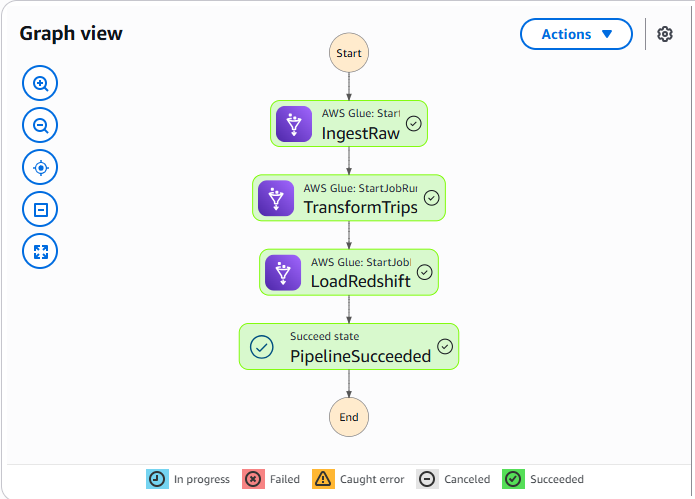

# AWS Serverless ELT Pipeline

Cloud-native ELT pipeline: NYC TLC yellow-taxi parquet → S3 → Glue → Redshift Serverless, orchestrated by Step Functions and scheduled monthly with EventBridge.

No Docker. No servers. Everything runs on managed AWS services.

Companion project to [tlc-pipeline](https://github.com/primalrun/tlc-pipeline) (self-managed Docker + Airflow) and [crypto-stream-pipeline](https://github.com/primalrun/crypto-stream-pipeline) (streaming). Together they cover batch, streaming, and cloud-native serverless patterns.

For implementation details see [INTERNALS.md](INTERNALS.md).

---

## Architecture

```
EventBridge Scheduler (monthly cron)
      │
      ▼
Lambda (computes current month - 2)
      │
      ▼
Step Functions Standard Workflow
      ├── IngestRaw      → Glue Python Shell  → downloads TLC parquet → S3 raw
      ├── TransformTrips → Glue Spark (G.1X)  → clean + rename cols   → S3 processed
      └── LoadRedshift   → Glue Python Shell  → delete month + COPY S3 → Redshift Serverless
```

Each Step Functions state uses the `.sync` optimized integration — it starts the Glue job and waits for completion before advancing. No polling code needed in the state machine.

The load step is **idempotent** — it deletes any existing rows for the target month before running COPY, so re-running the pipeline for the same month never duplicates data.

---

## Stack

| Layer | Technology |
|---|---|
| Orchestration | AWS Step Functions (Standard Workflow) |
| Ingest | AWS Glue Python Shell job |
| Transform | AWS Glue Spark job (Glue 4.0, G.1X worker) |
| Storage | Amazon S3 (raw + processed buckets) |
| Sink | Amazon Redshift Serverless (8 RPU, free tier eligible) |
| Schedule | Amazon EventBridge Scheduler (monthly cron) → Lambda → Step Functions |
| Infrastructure | Terraform (AWS provider ~> 5.0) |

---

## Redshift Table

**`yellow_trips`** — one row per taxi trip, loaded monthly

| Column | Type |
|---|---|
| vendor_id | INTEGER |
| pickup_datetime | TIMESTAMP |
| dropoff_datetime | TIMESTAMP |
| passenger_count | INTEGER |
| trip_distance | DOUBLE PRECISION |
| pickup_location_id | INTEGER |
| dropoff_location_id | INTEGER |
| payment_type | INTEGER |
| fare_amount | DOUBLE PRECISION |
| tip_amount | DOUBLE PRECISION |
| total_amount | DOUBLE PRECISION |

Table is created automatically by the load job on first run (`CREATE TABLE IF NOT EXISTS`).

---

## Prerequisites

- AWS account with IAM permissions for S3, Glue, Redshift, Step Functions, EventBridge, IAM
- Terraform >= 1.5
- AWS CLI configured (`aws configure` or environment variables)

---

## Setup

### 1. Clone and configure

```bash
git clone https://github.com/primalrun/aws-serverless-elt
cd aws-serverless-elt

cp terraform/terraform.tfvars.example terraform/terraform.tfvars
# Edit terraform.tfvars — set redshift_admin_password
```

### 2. Provision all infrastructure

```bash
make init
make apply
```

This creates: S3 buckets (raw, processed, scripts), Glue jobs, Lambda trigger, Redshift Serverless namespace + workgroup, Step Functions state machine, EventBridge schedule (disabled by default), and all IAM roles.

### 3. Run the pipeline

```bash
make run-pipeline YEAR=2024 MONTH=09
```

This starts a Step Functions execution. The three Glue jobs run sequentially (~10 minutes total).

### 4. Verify in Redshift

```bash
make verify
```

Or query directly in the Redshift Query Editor:

```sql
SELECT COUNT(*), DATE_TRUNC('month', pickup_datetime) AS month
FROM yellow_trips
GROUP BY 2
ORDER BY 2 DESC;
```

---

## Makefile Commands

| Command | Description |
|---|---|
| `make init` | `terraform init` |
| `make plan` | `terraform plan` |
| `make apply` | Provision all infrastructure |
| `make destroy` | Tear down all infrastructure |
| `make run-pipeline YEAR=2024 MONTH=09` | Start a pipeline execution |
| `make status` | List recent Step Functions executions |
| `make logs-glue` | Tail Glue job CloudWatch logs |
| `make verify` | Query Redshift row counts |

---

## Redshift Query Results

3.48 million trips loaded for September 2024.





---

## Step Functions Execution

All four states completing successfully — IngestRaw → TransformTrips → LoadRedshift → PipelineSucceeded.



---

## How It Works

### Step Functions — `.sync` integration

Each state in the workflow uses `arn:aws:states:::glue:startJobRun.sync`. The `.sync` suffix tells Step Functions to start the Glue job and then poll the job status until it reaches a terminal state (SUCCEEDED, FAILED, etc.) before moving to the next state. This replaces the manual Wait + GetJobRun polling loop that was common before optimized integrations existed.

### Glue Python Shell vs Spark

- **ingest_raw** and **load_redshift** use Python Shell (0.0625 DPU, ~1 cent per run) — they're pure I/O operations with no data processing.
- **transform_trips** uses a Spark G.1X worker — it reads potentially millions of rows, applies column selection and filtering, and rewrites as parquet.

### Redshift Data API

The `load_redshift` job connects to Redshift Serverless via the Redshift Data API rather than a direct JDBC connection. This avoids VPC configuration (no need to place Glue in the same VPC as Redshift) and works with Redshift Serverless's IAM authentication.

### Lambda Trigger

The `lambda/trigger.py` function sits between EventBridge Scheduler and Step Functions. It computes `current month - 2` (the latest available TLC data release) and starts a Step Functions execution with the correct year and month — no hardcoded dates.

EventBridge Scheduler is set to `DISABLED` by default. To enable the monthly automation, change `state = "DISABLED"` to `state = "ENABLED"` in `terraform/eventbridge.tf` and run `make apply`.

For ad-hoc runs, `make run-pipeline YEAR=2024 MONTH=09` calls Step Functions directly, bypassing EventBridge and Lambda entirely.

---

## Lessons Learned

Issues encountered during implementation and how they were resolved.

**Glue Python Shell 3.9 bundles outdated botocore**
The botocore version bundled in Glue Python Shell 3.9 predates the `WorkgroupName` parameter added to the Redshift Data API's `execute_statement` call. Fixed by adding `--additional-python-modules = "boto3>=1.26.0,botocore>=1.29.0"` to the Glue job's default arguments, which upgrades boto3 at job start.

**Glue role missing `redshift-serverless:GetCredentials`**
The Redshift Data API requires `redshift-serverless:GetCredentials` in addition to `redshift-data:ExecuteStatement` when authenticating against a Serverless workgroup via IAM. The initial IAM policy had `GetWorkgroup` but not `GetCredentials`. Added the missing action to the Glue role policy.

**Redshift Query Editor v2 permission denied**
The `yellow_trips` table was created by the Glue job connecting as `IAM:tlc-pipeline-dev`. Connecting to Query Editor v2 using federated IAM credentials resulted in a permission denied error. Fixed by switching the Query Editor connection to database username and password (admin credentials set during Terraform provisioning).

---

## Project Structure

```
aws-serverless-elt/
├── glue/
│   └── jobs/
│       ├── ingest_raw.py        # Python Shell: download TLC parquet → S3 raw
│       ├── transform_trips.py   # Spark G.1X: clean + transform → S3 processed
│       └── load_redshift.py     # Python Shell: delete month + COPY S3 → Redshift
├── lambda/
│   └── trigger.py               # Computes current month - 2, starts Step Functions
├── terraform/
│   ├── providers.tf
│   ├── variables.tf
│   ├── outputs.tf
│   ├── s3.tf                    # Raw, processed, scripts buckets
│   ├── iam.tf                   # Glue, Redshift, Step Functions, Lambda, EventBridge roles
│   ├── glue.tf                  # Glue jobs + script upload to S3
│   ├── lambda.tf                # Lambda trigger function + IAM role
│   ├── redshift.tf              # Redshift Serverless namespace + workgroup
│   ├── stepfunctions.tf         # State machine definition (ASL)
│   ├── eventbridge.tf           # Monthly scheduler (disabled by default)
│   └── terraform.tfvars.example
├── sql/
│   └── create_tables.sql        # Reference DDL + verification queries
├── Makefile
├── .env.example
└── README.md
```
